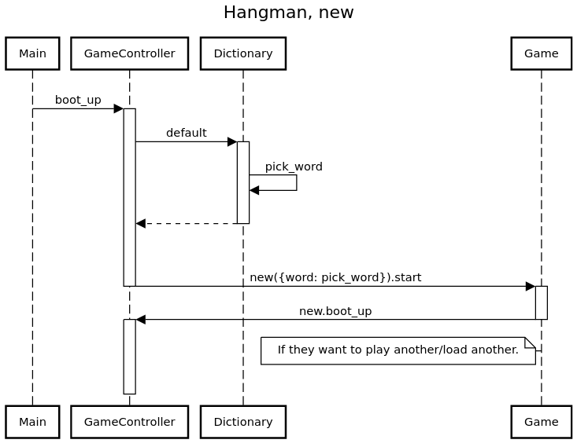
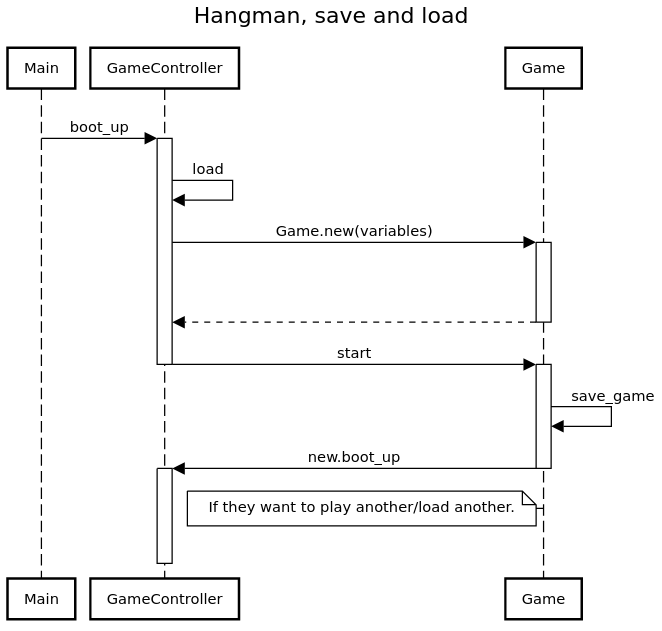

# Hangman

Command-line Hangman game made in Ruby that features saving and loading.

When I began working on this project I hoped to use multiple Ruby files for my classes and modules.
Managed to deliver on this one!

Specification and instruction from [The Odin Project](https://www.theodinproject.com/paths/full-stack-ruby-on-rails/courses/ruby-programming/lessons/hangman)

## How to play

For online, visit the [Replit](https://replit.com/@scheals/Hangman#main.rb)

For offline play simply download the files to one directory and run main.rb.

## Features
* Play a hangman game in a command line
* Save/load after every round
* Possible to replace default dictionary outside of the basic script (requires using present interface)

## Possible future additions

### UI / UX
* Some graphical representation of lives
* Colours to make things stand out

### Internal
* Decouple `Display/MessageText` so they become one class that others send messages to
* Create a `Player` class to lessen the burden of `GameLogic` module on `Game`
* Either get rid of additional Dictionary functionality or make use of it

## Reflections

This project is my comeback from an OOP confidence slump that I felt after Tic-Tac-Toe and Mastermind.
I have tried to apply knowledge that I've gained by going through these projects, feedback I've gotten
and other people's code - shoutout to [rlmoser99's Mastermind](https://github.com/rlmoser99/ruby_Mastermind)
for being a safe haven. Finished POODR before taking this project on too, which was great help.

First time doing my own serialization of my own objects, so it is neat to have learnt about Psych
and using skills picked up from POODR felt grounding. There's lots of me to learn but I'm back in the saddle
when it comes to believing I can do it. Overall I can say that this project taught me:

* The basics of serialization
* Using multiple files for my classes/modules
* Using new debug gem together with its VSCode implementation
* Creating and using sequence diagrams, thanks POODR!
* How powerful Regex is

## Sequence diagrams

## Acknowledgements

README layout from [Chargrilled Chook](https://github.com/ChargrilledChook)
